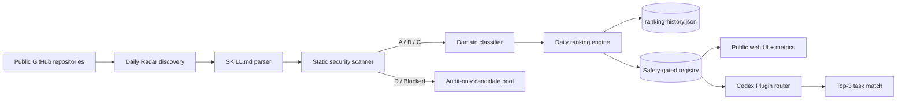

# SkillRadar

> **Open-source discovery, security, ranking, and routing infrastructure for Agent Skills and Codex.**

[](https://github.com/changchangidea-oss/SkillRadar/releases)
[](https://github.com/changchangidea-oss/SkillRadar/actions/workflows/design-radar.yml)
[](https://github.com/changchangidea-oss/SkillRadar/actions/workflows/security.yml)
[](LICENSE)
[](https://agentskills.io)
[](https://github.com/changchangidea-oss/SkillRadar/stargazers)


SkillRadar is **not another list of bookmarked skill repositories**. It is an auditable intelligence layer between the fast-growing Agent Skills ecosystem and the coding agent that needs one capability *right now*.

It continuously discovers public `SKILL.md` files, parses their real contents, performs a conservative static security scan, classifies them by task/domain, combines quality + maintenance + popularity + safety signals, keeps daily ranking history, and exposes the same safety-gated registry to both the public web UI and the Codex plugin.

**Current closed loop:**

`Radar → Parse → Security scan → Classify → Rank → Publish registry → Codex route`

## Why this exists

Installing hundreds of skills is the wrong optimization. It increases context pressure, makes provenance harder to track, and turns task routing into guesswork.

SkillRadar takes the opposite approach:

- keep discovery broad;
- keep installation narrow;
- inspect before trusting;
- separate popularity from permission;
- return a small Top-3 match for the actual task;
- make ranking changes and safety decisions observable in GitHub.

## 60-second quick start

### Option A — full Codex Plugin

Current Codex supports Git marketplace sources and marketplace-backed plugin installation. Add this repository as a marketplace and install SkillRadar in one shell line:

```bash
codex plugin marketplace add changchangidea-oss/SkillRadar --ref v0.3.0 && codex plugin add skillradar@skillradar
```

Then start a fresh Codex thread and ask, for example:

```text
Find a safe skill for a Remotion product launch video and explain why you picked it.
```

### Option B — standard Agent Skill / skills.sh ecosystem

```bash
npx skills add changchangidea-oss/SkillRadar --skill skillradar
```

The standard skill is intentionally read-first: it helps an agent discover and inspect skills without automatically executing discovered code.

### Option C — run the registry UI locally

```bash
git clone https://github.com/changchangidea-oss/SkillRadar.git
cd SkillRadar
npm run validate
npm run serve
```

Open `http://localhost:4173`.

## Public metrics

The project publishes operational evidence instead of hard-coding marketing numbers.

**Metrics page:** `https://changchangidea-oss.github.io/SkillRadar/metrics.html` (available after GitHub Pages is enabled for the repository).

The page reads directly from generated repository data and shows:

- total indexed skills (`seed + live Radar`);
- 12 design domains;
- latest daily Radar status;
- active / review / blocked candidate counts;
- Codex Top-3 routing model;
- daily ranking snapshots from `data/ranking-history.json`.

At the time v0.3.0 was prepared, the live registry had **92 design skills (83 seed + 9 Radar), 12 design domains, a daily security scan, and Codex routing against the same registry**. These numbers are expected to change automatically.

## Architecture



### The safety boundary

**Discovery is not execution.**

The scanner looks for high-risk patterns and capabilities including destructive shell commands, pipe-to-shell installs, remote shell use, dynamic execution, secret access, networking, package installation, filesystem writes, git writes, and deploy tooling.

Grades are conservative:

- **A** — low-risk static profile.
- **B** — limited side-effect surface or scripts require awareness.
- **C** — explicit review required before recommendation/installation.
- **D** — audit-only; excluded from dynamic Top 20 and Codex automatic routing.
- **Blocked** — prohibited from automatic routing.

This is **not** a formal security audit or sandbox. The goal is to make risk visible *before* an agent installs or runs something.

## Design Radar

SkillRadar currently maintains 12 design fields:

UI Design · Visual Communication · Operations Design · Video Design · Industrial Design · Environmental Design · Fashion Design · Experience Design · Digital Media & Film · Arts & Crafts · Folk Art · Architecture Design.

Each field started with a curated Top 20 seed baseline. New Radar candidates do not automatically jump to the top: they compete using parsed quality, maintenance, popularity, safety, domain relevance, and maturity signals. Daily snapshots are committed to `data/ranking-history.json`.

## Codex Plugin

The plugin lives in `packages/codex-plugin/` and includes:

- `skill-router` — map a real task to a small, relevant skill stack;
- `find-skill` — search by task, technology, category, or design field;
- `inspect-skill` — inspect provenance, maintenance, safety, and intended use;
- `manage-skills` — keep global/project skill sets compact.

A repository-level Codex marketplace lives at `.agents/plugins/marketplace.json`, so Codex can install directly from GitHub. The plugin reads the same generated registry as the website and filters D/Blocked candidates again at runtime as defense in depth.

## Repository map

```text
SkillRadar/
├── .agents/plugins/marketplace.json    # Codex marketplace entry
├── skills/skillradar/SKILL.md           # standard Agent Skill
├── index.html                            # registry UI
├── metrics.html                          # public operational metrics
├── assets/                               # web UI
├── data/
│   ├── design-skills-1..4.json           # seed registry
│   ├── design-skills-radar.json          # safety-gated Radar shard
│   ├── design-domains.json               # live Top 20 rankings
│   ├── design-seed-baseline.json         # immutable seed baseline
│   ├── radar-latest.json                 # latest run
│   ├── radar-registry.json               # audit candidate pool
│   └── ranking-history.json              # daily snapshots
├── packages/codex-plugin/
├── scripts/
└── .github/workflows/
```

## Open-source operating model

The repository intentionally keeps evidence in public Git history:

- the daily bot commits generated Radar data;
- ranking snapshots show how Top 20 lists move;
- security-gated candidates remain inspectable;
- Issues and PRs are the source of roadmap and maintenance discussion;
- Releases package stable plugin versions;
- CI verifies registry integrity, secret patterns, and ecosystem manifests.

We do **not** manufacture Stars, Forks, installs, or contributor activity. Adoption metrics should represent real external users.

## GitHub Pages

Pages workflows are included. GitHub requires the repository-level Pages source to be enabled once. Set:

`Settings → Pages → Build and deployment → Source: GitHub Actions`

After that one-time account setting, pushes and Radar refreshes can publish the current registry and metrics page automatically.

## Contributing

Useful first contributions include:

- add or correct a Skill source;
- improve a static safety rule and add a fixture;
- improve domain classification/ranking;
- add a new non-design taxonomy adapter;
- test Codex / skills CLI installation on another OS;
- improve accessibility or data visualization on the metrics page.

See [CONTRIBUTING.md](CONTRIBUTING.md). Security issues should follow [SECURITY.md](SECURITY.md).

## Release

See [v0.3.0 release notes](docs/releases/v0.3.0.md).

## License

MIT — see [LICENSE](LICENSE).
