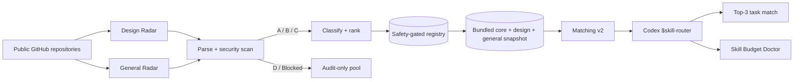

# SkillRadar

> **Open-source discovery, security, ranking, and routing infrastructure for Agent Skills and Codex.**

[](https://github.com/changchangidea-oss/SkillRadar/releases)
[](https://github.com/changchangidea-oss/SkillRadar/actions/workflows/design-radar.yml)
[](https://github.com/changchangidea-oss/SkillRadar/actions/workflows/security.yml)
[](LICENSE)
[](https://agentskills.io)
[](https://github.com/changchangidea-oss/SkillRadar/stargazers)


SkillRadar is **not another list of bookmarked skill repositories**. It is an auditable intelligence layer between the fast-growing Agent Skills ecosystem and the coding agent that needs one capability *right now*.

It discovers public `SKILL.md` files, parses their real contents, performs a conservative static security scan, classifies them by task/domain, combines relevance + quality + maintenance + popularity + safety signals, and exposes the same safety-gated registry to both the public web UI and the Codex plugin.

**v0.4 closed loop:**

`Design Radar + General Radar → Parse → Security scan → Classify → Rank → Deduplicate → Bundle → Match v2 → Codex route`

## Why this exists

Installing hundreds of skills is the wrong optimization. It increases context pressure, makes provenance harder to track, and turns task routing into guesswork.

SkillRadar takes the opposite approach:

- keep discovery broad;
- keep active skill context narrow;
- inspect before trusting;
- separate popularity from permission;
- return a small Top-3 match for the actual task;
- explain why the match happened;
- measure and reduce skill-context pressure instead of blindly deleting capabilities.

## 60-second quick start

### Option A — full Codex Plugin

```bash
codex plugin marketplace add changchangidea-oss/SkillRadar --ref v0.4.0 && codex plugin add skillradar@skillradar
```

Start a fresh Codex thread, then route a task:

```text
$skill-router
Find the best skills for a Next.js AI dashboard with tool calling and shadcn/ui.
```

Or diagnose a crowded Codex skill catalog:

```text
$manage-skills
Audit my active Skills for this project and show me what I can safely disable to reduce context pressure. Do not change configuration yet.
```

**v0.4.0 is offline-first and registry-first for explicit routing.** The installed plugin ships with a complete safety-gated `core + design + general` registry snapshot. Normal Top-3 routing does not require cloning this repository or fetching GitHub Raw.

A successful route exposes `source: skillradar-registry`, `registry.mode: local-bundled`, `ranking.version: 2.0`, `match_score`, `skillradar_score`, `security`, `source`, `reason`, and `match_details`.

### Option B — standard Agent Skill / skills.sh ecosystem

```bash
npx skills add changchangidea-oss/SkillRadar --skill skillradar
```

The standard skill is intentionally read-first: discovery does not authorize third-party execution.

### Option C — run the registry UI locally

```bash
git clone https://github.com/changchangidea-oss/SkillRadar.git
cd SkillRadar
npm run validate
npm run serve
```

Open `http://localhost:4173`.

## Wider discovery in v0.4

SkillRadar keeps the existing 12-field Design Radar and adds a **General Agent Skills Radar** across 10 domains:

AI Agents · Frontend · Backend & API · Data & Database · Testing & Quality · DevOps & Cloud · Security · Mobile · Automation & Integrations · Docs & Research.

General discovery combines multiple channels rather than relying on one repository query:

- GitHub repository search;
- GitHub `SKILL.md` code search when available;
- broad Agent / Claude / Codex skill ecosystem queries.

Candidates record discovery channels, coverage, domain evidence, quality, maintenance, popularity, security findings and provenance. D/Blocked candidates stay audit-only and cannot enter the bundled routing shard.

Operational coverage is written to `data/general-radar-latest.json`; the auditable candidate pool is `data/general-radar-registry.json`.

## Matching v2

Raw substring matching is not enough. v0.4 Matching v2:

- recognizes concepts/phrases such as App Router, tool calling and design systems;
- avoids short-token substring mistakes such as `ai` matching `tailwind`;
- weights identity, tags, domains, summary and source differently;
- measures how much of the user's task is actually covered;
- combines evidence with SkillRadar quality, safety and freshness priors;
- diversity-reranks Top 3 so near-duplicate capabilities do not consume every slot;
- emits `match_details` for auditability.

If a C-grade skill ranks first and an A/B candidate is within five match-score points, SkillRadar surfaces a safer-alternative advisory.

## Skill Budget Doctor

Current Codex has a finite model-visible skill metadata budget; crowded catalogs cause descriptions to be shortened or eventually omitted. `$manage-skills` now uses a real read-only doctor instead of generic cleanup advice.

The doctor inventories user, project and enabled plugin skills, estimates catalog pressure, detects near duplicates, uses current project/task relevance as a pruning signal, and generates:

- current pressure / usage / budget ratio;
- duplicate groups and preferred keepers;
- projected ratio after pruning;
- `[[skills.config]] ... enabled = false` snippets;
- whole-plugin removal suggestions only when most capabilities in that plugin are redundant.

It does **not** edit `~/.codex/config.toml`, disable skills, uninstall plugins or execute discovered scripts without a later explicit approval.

## Architecture



## Safety boundary

**Discovery is not execution.**

The scanner looks for high-risk patterns and capabilities including destructive shell commands, pipe-to-shell installs, remote shell use, dynamic execution, secret access, networking, package installation, filesystem writes, git writes, and deploy tooling.

Grades are conservative:

- **A** — low-risk static profile.
- **B** — limited side-effect surface or scripts require awareness.
- **C** — explicit review required before recommendation/installation.
- **D** — audit-only; excluded from automatic routing.
- **Blocked** — prohibited from automatic routing.

This is **not** a formal security audit or sandbox. The goal is to make risk visible before an agent installs or runs something.

## Codex Plugin

The plugin lives in `packages/codex-plugin/` and includes:

- `skill-router` — task → evidence-backed Top 3;
- `find-skill` — search core, general and design registries;
- `inspect-skill` — provenance, quality and safety inspection;
- `manage-skills` — Skill Budget Doctor for context pressure and duplicate cleanup.

A repository-level Codex marketplace lives at `.agents/plugins/marketplace.json`, so Codex can install directly from GitHub. The plugin filters D/Blocked candidates again at runtime as defense in depth.

## Repository map

```text
SkillRadar/
├── .agents/plugins/marketplace.json
├── skills/skillradar/SKILL.md
├── data/
│   ├── skills.json                       # curated core
│   ├── design-skills-*.json              # design seed + live Radar
│   ├── general-domains.json              # 10-domain general taxonomy
│   ├── general-skills-radar.json         # safety-gated general routing shard
│   ├── general-radar-registry.json       # auditable general candidates
│   └── general-radar-latest.json         # discovery coverage metrics
├── packages/codex-plugin/
│   ├── data/registry.json                # schema-v2 bundled snapshot
│   ├── scripts/skillradar.mjs            # Matching v2 router CLI
│   ├── scripts/skill-budget.mjs           # read-only Skill Budget Doctor
│   └── skills/
├── scripts/
└── .github/workflows/
```

## Open-source operating model

The repository intentionally keeps evidence in public Git history. Daily bots commit generated Radar data and refreshed bundled snapshots; ranking and discovery metrics remain inspectable; CI verifies security patterns, registry integrity, Matching v2, plugin-only offline routing, Skill Budget Doctor behavior, and public marketplace installation.

We do **not** manufacture Stars, Forks, installs, or contributor activity. Adoption metrics should represent real external users.

## Public pages

- Registry: `https://changchangidea-oss.github.io/SkillRadar/`
- Metrics: `https://changchangidea-oss.github.io/SkillRadar/metrics.html`

## Contributing

Useful contributions include new Skill sources, safety rules/fixtures, domain taxonomy improvements, ranking improvements, OS compatibility tests, and UI/metrics improvements. See [CONTRIBUTING.md](CONTRIBUTING.md) and [SECURITY.md](SECURITY.md).

## Release

See [v0.4.0 release notes](docs/releases/v0.4.0.md).

## License

MIT — see [LICENSE](LICENSE).
