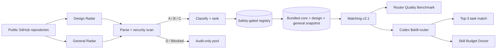

# SkillRadar

> **Open-source discovery, security, ranking, and routing infrastructure for Agent Skills and Codex.**

[](https://github.com/changchangidea-oss/SkillRadar/releases)
[](https://github.com/changchangidea-oss/SkillRadar/actions/workflows/design-radar.yml)
[](https://github.com/changchangidea-oss/SkillRadar/actions/workflows/router-benchmark.yml)
[](https://github.com/changchangidea-oss/SkillRadar/actions/workflows/security.yml)
[](LICENSE)
[](https://agentskills.io)
[](https://github.com/changchangidea-oss/SkillRadar/stargazers)


**Give SkillRadar a coding task. It returns a small, safety-gated, evidence-backed set of Agent Skills instead of asking you to install an entire skill catalog.**

SkillRadar discovers public `SKILL.md` files, parses their real contents, performs conservative static security checks, ranks candidates, bundles an offline registry, and routes tasks to relevant Skills without automatically executing untrusted third-party code.

## Try it in 60 seconds

### Codex Plugin

```bash
codex plugin marketplace add changchangidea-oss/SkillRadar --ref v0.5.0 && codex plugin add skillradar@skillradar
```

Start a fresh Codex thread and run:

```text
$skill-router
Find the best skills for a Next.js AI dashboard with tool calling and shadcn/ui.
```

A successful route should give you a small Top-3 result with auditable fields such as:

- `source: skillradar-registry`
- `registry.mode: local-bundled`
- `match_score`
- `skillradar_score`
- `security`
- `source`
- `reason`
- `match_details`

The installed plugin is offline-first and registry-first for explicit routing. Normal Top-3 routing does not require cloning this repository or fetching GitHub Raw.

### Standard Agent Skill / skills.sh ecosystem

```bash
npx skills add changchangidea-oss/SkillRadar --skill skillradar
```

The standard Skill is intentionally read-first: discovery does not authorize third-party execution.

### Local registry UI

```bash
git clone https://github.com/changchangidea-oss/SkillRadar.git
cd SkillRadar
npm run validate
npm run benchmark:router
npm run serve
```

Open `http://localhost:4173`.

## Tried it? Tell us what happened

Real usage is more useful than synthetic demos.

- [Install failed](https://github.com/changchangidea-oss/SkillRadar/issues/new?template=install-problem.yml)
- [Wrong route or missing technology](https://github.com/changchangidea-oss/SkillRadar/issues/new?template=routing-gap.yml)
- [Share real usage feedback](https://github.com/changchangidea-oss/SkillRadar/issues/new?template=user-feedback.yml)

Please remove tokens, credentials, private source code, and other sensitive data before posting.

## Why SkillRadar exists

Installing hundreds of Skills is the wrong optimization. It increases context pressure, makes provenance harder to track, and turns task routing into guesswork.

SkillRadar takes the opposite approach:

- keep discovery broad;
- keep active Skill context narrow;
- inspect before trusting;
- separate popularity from permission;
- return a small Top-3 match for the actual task;
- explain why the match happened;
- prefer an explicit capability gap over unrelated generic filler;
- measure routing quality instead of tuning by intuition;
- reduce Skill-context pressure instead of blindly deleting capabilities.

## What makes it different

### Safety-gated discovery

Every discovered candidate passes through parsing and static security analysis. D/Blocked candidates remain audit-only and cannot enter the bundled routing shard.

### Technology-specific evidence

Named technologies and services should be supported by specific evidence. Generic words such as `workflow`, `integration`, or `data` are not enough to justify a recommendation for a named tool or framework.

If the registry lacks a relevant capability, SkillRadar can expose that gap instead of filling Top-3 with unrelated Skills.

### Offline-first explicit routing

The Codex plugin ships with a complete safety-gated `core + design + general` registry snapshot. Explicit routing can operate from the bundled registry without executing candidate repositories or depending on live GitHub discovery.

### Auditable ranking

A route exposes relevance, SkillRadar score, security, provenance, reason, and match details so a recommendation can be inspected instead of treated as a black box.

## Discovery coverage

SkillRadar combines the 12-field Design Radar with a General Agent Skills Radar across 10 domains:

AI Agents · Frontend · Backend & API · Data & Database · Testing & Quality · DevOps & Cloud · Security · Mobile · Automation & Integrations · Docs & Research.

General discovery combines multiple channels rather than relying on one repository query:

- GitHub repository search;
- GitHub `SKILL.md` code search when available;
- broad Agent / Claude / Codex Skill ecosystem queries.

Candidates record discovery channels, coverage, domain evidence, quality, maintenance, popularity, security findings, and provenance.

Operational coverage is written to `data/general-radar-latest.json`; the auditable candidate pool is `data/general-radar-registry.json`.

## Matching v2.1

Raw substring matching is not enough. Matching v2.1:

- recognizes concepts and phrases such as App Router, tool calling, and design systems;
- avoids short-token substring mistakes such as `ai` matching `tailwind`;
- weights identity, tags, domains, summary, and source differently;
- measures how much of the explicit task is covered;
- combines relevance with quality, safety, and freshness priors;
- uses project metadata only as a bounded secondary tie-break;
- caps project-context bonus;
- complementary-reranks Top 3 so the set covers distinct task facets;
- emits task signal weights, project-context evidence, and other `match_details` for auditability.

Project context is deliberately narrow: dependency names, common config filenames, and framework directories may be read. Source-file contents, environment-variable values, credentials, and candidate third-party scripts are not used for project-context routing.

If a C-grade Skill ranks first and an A/B candidate is within five match-score points, SkillRadar surfaces a safer-alternative advisory.

## Router Quality Benchmark

The repository includes a golden benchmark so ranking changes have a measurable contract instead of relying on subjective spot checks.

The v0.5 baseline recorded:

- 7 / 7 golden routing cases passed;
- pass rate: 100%;
- D / Blocked results in Top-3: 0;
- average Top-1 match score: 85.1;
- project-context fixture: passed;
- explicit task-dominance fixture: passed.

The multi-capability AI Dashboard case is intentionally strict: the Top-3 must include `nextjs`, `ai-sdk`, and `shadcn`, proving that the reranker covers distinct explicit task facets instead of filling slots with generic near-matches.

Benchmark inputs live in `data/router-benchmark.json`; the latest auditable result is committed to `data/router-benchmark-latest.json`. CI and the release workflow enforce the benchmark. Weight changes remain code-reviewed and benchmark-gated.

## Skill Budget Doctor

Current Codex has a finite model-visible Skill metadata budget; crowded catalogs can create context pressure. `$manage-skills` uses a read-only doctor instead of generic cleanup advice.

It inventories user, project, and enabled plugin Skills, estimates catalog pressure, detects near duplicates, uses current project/task relevance as a pruning signal, and generates:

- current pressure / usage / budget ratio;
- duplicate groups and preferred keepers;
- projected ratio after pruning;
- `[[skills.config]] ... enabled = false` snippets;
- whole-plugin removal suggestions only when most capabilities in that plugin are redundant.

It does **not** edit `~/.codex/config.toml`, disable Skills, uninstall plugins, or execute discovered scripts without a later explicit approval.

## Architecture



## Safety boundary

**Discovery is not execution.**

The scanner looks for high-risk patterns and capabilities including destructive shell commands, pipe-to-shell installs, remote shell use, dynamic execution, secret access, networking, package installation, filesystem writes, git writes, and deploy tooling.

Grades are conservative:

- **A** — low-risk static profile.
- **B** — limited side-effect surface or scripts require awareness.
- **C** — explicit review required before recommendation/installation.
- **D** — audit-only; excluded from automatic routing.
- **Blocked** — prohibited from automatic routing.

This is **not** a formal security audit or sandbox. The goal is to make risk visible before an agent installs or runs something.

## Codex Plugin

The plugin lives in `packages/codex-plugin/` and includes:

- `skill-router` — task → evidence-backed Top 3;
- `find-skill` — search core, general, and design registries;
- `inspect-skill` — provenance, quality, and safety inspection;
- `manage-skills` — Skill Budget Doctor for context pressure and duplicate cleanup.

A repository-level Codex marketplace lives at `.agents/plugins/marketplace.json`, so Codex can install directly from GitHub. The plugin filters D/Blocked candidates again at runtime as defense in depth.

## Repository map

```text
SkillRadar/
├── .agents/plugins/marketplace.json
├── .github/ISSUE_TEMPLATE/
├── skills/skillradar/SKILL.md
├── data/
│   ├── skills.json
│   ├── design-skills-*.json
│   ├── general-domains.json
│   ├── general-skills-radar.json
│   ├── general-radar-registry.json
│   ├── general-radar-latest.json
│   ├── router-benchmark.json
│   └── router-benchmark-latest.json
├── packages/codex-plugin/
│   ├── data/registry.json
│   ├── scripts/skillradar.mjs
│   ├── scripts/skill-budget.mjs
│   └── skills/
├── docs/ADOPTION.md
├── scripts/
└── .github/workflows/
```

## Open-source operating model

The repository intentionally keeps evidence in public Git history. Daily bots commit generated Radar data and refreshed bundled snapshots; benchmark and routing-quality evidence remain inspectable; CI verifies security patterns, registry integrity, project-context boundaries, plugin-only offline routing, Router Quality Benchmark behavior, Skill Budget Doctor behavior, and public marketplace installation.

We do **not** manufacture Stars, Forks, installs, contributor activity, testimonials, or feedback. See [`docs/ADOPTION.md`](docs/ADOPTION.md) for the evidence rules used by the project.

## Public pages

- Registry: `https://changchangidea-oss.github.io/SkillRadar/`
- Metrics: `https://changchangidea-oss.github.io/SkillRadar/metrics.html`

## Contributing

Code contributions and usage reports are both useful. See [CONTRIBUTING.md](CONTRIBUTING.md).

Useful contributions include new public Skill sources, safety rules/fixtures, domain taxonomy improvements, ranking improvements, benchmark cases, OS compatibility tests, UI/metrics improvements, install reports, and real routing feedback.

## Release

See [v0.5.0 release notes](docs/releases/v0.5.0.md).

## License

MIT — see [LICENSE](LICENSE).
